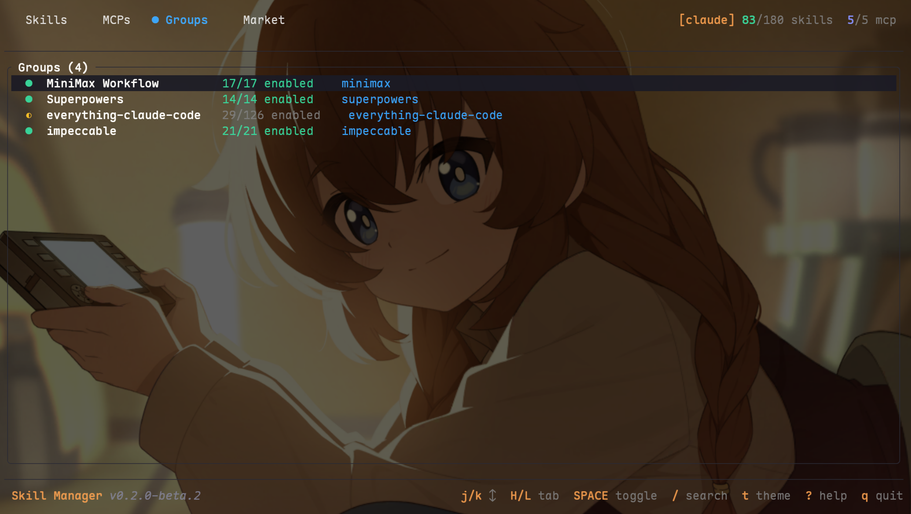

# Skill Manager

[English](README.md) | **中文**

终端界面的 AI CLI skill/MCP 资源管理器。支持 **Claude Code**、**Codex**、**Gemini CLI** 和 **OpenCode**。



## 功能特性

- **TUI 终端界面** — 浏览、启用/禁用、搜索 skills 和 MCPs
- **多 CLI 支持** — 跨 4 个 AI CLI 统一管理，`1234` 切换目标
- **分组管理** — 将 skills/MCPs 组织成组，批量启用/禁用，重命名
- **一键安装** — `skill-manager install owner/repo` 自动下载、注册、分组、启用
- **Skill 发现** — 内置递归扫描器，秒级发现磁盘上所有 SKILL.md
- **Skill 市场** — 浏览 2000+ 来自 5 个内置源的 skills，支持自定义 GitHub 源
- **MCP 服务器** — 25 个工具通过 MCP 协议暴露，首次启动自动注册到所有 CLI
- **深色/亮色主题** — 按 `t` 切换，适配两种终端背景
- **文件系统为唯一数据源** — skill 启用 = 软链接存在；MCP 启用 = 配置条目存在
- **备份与恢复** — 带时间戳的完整备份，包括 skill 文件、MCP 配置和 CLI 配置
- **命令行** — 子命令支持脚本自动化

## 安装

```bash
git clone https://github.com/Crosery/skill-manager.git
cd skill-manager
cargo install --path .
```

## 快速开始

```bash
# 启动 TUI（首次运行会自动扫描并注册 MCP）
skill-manager

# 从 GitHub 安装 skills（自动下载、注册、分组、启用）
skill-manager install pbakaus/impeccable
skill-manager install MiniMax-AI/skills

# 从市场安装
skill-manager market-install github

# 发现磁盘上所有 skill
skill-manager discover
skill-manager discover --root /    # 全盘扫描

# CLI 管理
skill-manager list                    # 列出所有 skills 和 MCPs
skill-manager status                  # 查看启用数量
skill-manager enable brainstorming    # 启用某个 skill
skill-manager scan                    # 扫描已知目录
skill-manager backup                  # 创建备份
```

## TUI 快捷键

底部显示常用按键，按 `?` 打开完整帮助面板。

| 按键 | 操作 |
|------|------|
| `j/k` | 上下导航 |
| `H/L` 或 `Tab` | 切换标签页（Skills / MCPs / Groups / Market） |
| `Space` | 启用/禁用 |
| `/` | 搜索过滤 |
| `t` | 切换深色/亮色主题 |
| `?` | 帮助面板（所有快捷键） |
| `q` | 退出 |

## MCP 工具（25 个）

作为 MCP 服务器运行时（`skill-manager mcp-serve`），提供 25 个工具：

**Skills 和 MCPs**

| 工具 | 说明 |
|------|------|
| `sm_list` | 列出 skills/MCPs（精简格式，支持按类型/分组/目标过滤） |
| `sm_status` | 各 CLI 的启用/总数统计 |
| `sm_enable` / `sm_disable` | 启用/禁用（支持模糊组名匹配） |
| `sm_delete` | 删除 skill/MCP（文件 + 软链接 + 数据库） |
| `sm_scan` | 扫描已知目录发现新 skills |
| `sm_discover` | 全盘发现 SKILL.md，返回未管理的 skill 列表 |
| `sm_batch_enable` / `sm_batch_disable` | 批量启用/禁用多个 |

**安装**

| 工具 | 说明 |
|------|------|
| `sm_install` | 返回 CLI 安装命令（AI 通过 Bash 执行，避免代理超时） |
| `sm_market` | 浏览缓存的市场 skills（按源/关键词过滤） |
| `sm_market_install` | 返回市场安装 CLI 命令 |
| `sm_sources` | 列出/添加/删除/启用/禁用市场源 |

**分组**

| 工具 | 说明 |
|------|------|
| `sm_groups` | 列出所有分组及成员数 |
| `sm_create_group` / `sm_delete_group` | 创建/删除分组 |
| `sm_group_add` / `sm_group_remove` | 添加/移除成员（支持单个 `name` 或批量 `names`） |
| `sm_update_group` | 更新分组名称和/或描述 |
| `sm_group_enable` / `sm_group_disable` | 批量启用/禁用分组成员（模糊组名匹配） |

**备份与工具**

| 工具 | 说明 |
|------|------|
| `sm_backup` | 创建带时间戳的备份 |
| `sm_restore` | 从备份恢复（默认最新，可指定时间戳） |
| `sm_backups` | 列出所有可用备份 |
| `sm_register` | 注册 MCP 到所有 CLI 配置 |

## 关键特性

- **模糊组名匹配** — `sm_group_enable(name="superpower")` 自动匹配 `superpowers`
- **安装委托 CLI** — MCP 工具返回 Bash 命令而非进程内下载（避免代理超时）
- **精简输出** — `sm_list` 使用单行格式，避免超出 token 限制
- **自动发现** — MCP 指令引导 AI 在市场没有结果时自动搜索 GitHub
- **自我保护** — skill-manager 拒绝禁用自身
- **扫描 `~/skills/`** — 自动发现 SkillHub 安装的 skill

## Skill 发现

```bash
skill-manager discover               # 扫描 home 目录
skill-manager discover --root /      # 全盘扫描
```

内置递归扫描器，智能过滤：
- **扫描**: `~/.skill-manager/skills/`、`~/.claude/skills/`、`~/skills/`、项目目录
- **跳过**: plugins/marketplaces、IDE 扩展、备份目录、node_modules、.git
- **分类**: `●` 已管理 / `◆` CLI 目录 / `○` 未管理（可导入）

## 市场源

内置源（在 Market 标签页按 `s` 管理）：

| 源 | Skills 数量 | 默认状态 |
|----|------------|----------|
| Anthropic Official | 23 | 启用 |
| Everything Claude Code | 125 | 启用 |
| Terminal Skills | 900+ | 禁用 |
| Antigravity Skills | 1300+ | 禁用 |
| OK Skills | 55 | 禁用 |

按 `a` 添加自定义源（格式：`owner/repo` 或 `owner/repo@branch`）。

## 数据存储

所有数据存储在 `~/.skill-manager/`：
- `skills/` — 托管的 skill 目录（每个包含 SKILL.md）
- `mcps/` — 被禁用的 MCP 配置备份（JSON）
- `groups/` — 分组定义（TOML 文件）
- `backups/` — 带时间戳的完整备份
- `market-cache/` — 市场 skill 列表缓存（JSON，1 小时有效期）
- `market-sources.json` — 自定义市场源
- `skill-manager.db` — SQLite 数据库（仅 skill 元数据 + 分组成员）

## 许可证

MIT
